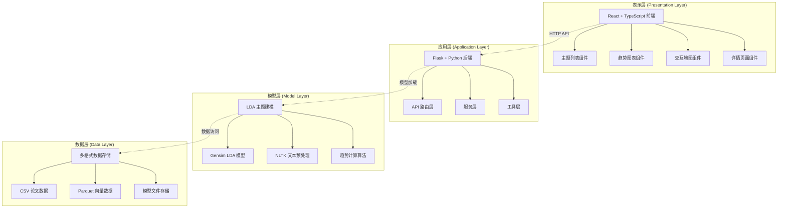
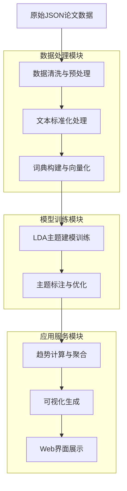
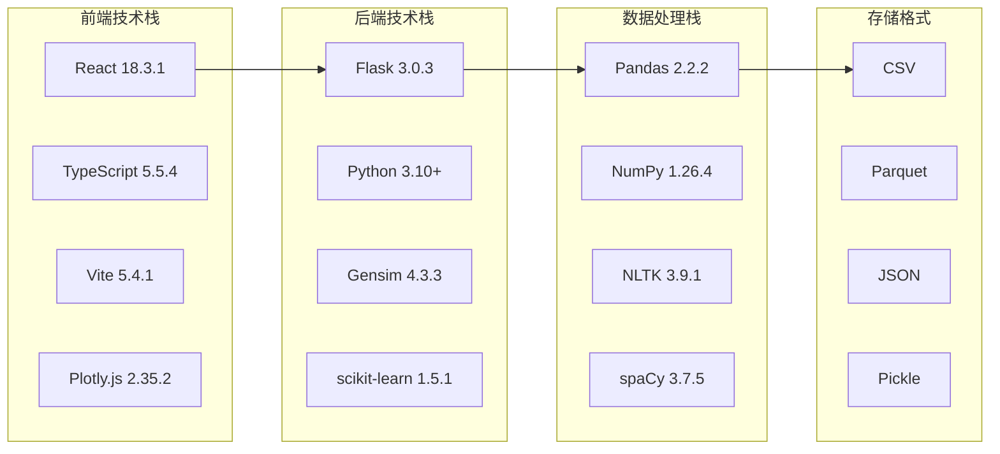
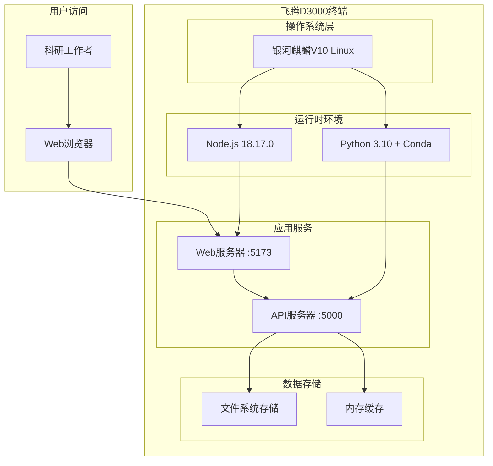

# 系统架构图

## 整体架构图

```mermaid
graph TB
    subgraph "表示层 (Presentation Layer)"
        A[React + TypeScript 前端]
        A1[主题列表组件]
        A2[趋势图表组件]
        A3[交互地图组件]
        A4[详情页面组件]
        A --> A1
        A --> A2
        A --> A3
        A --> A4
    end
    
    subgraph "应用层 (Application Layer)"
        B[Flask + Python 后端]
        B1[API 路由层]
        B2[服务层]
        B3[工具层]
        B --> B1
        B --> B2
        B --> B3
    end
    
    subgraph "模型层 (Model Layer)"
        C[LDA 主题建模]
        C1[Gensim LDA 模型]
        C2[NLTK 文本预处理]
        C3[趋势计算算法]
        C --> C1
        C --> C2
        C --> C3
    end
    
    subgraph "数据层 (Data Layer)"
        D[多格式数据存储]
        D1[CSV 论文数据]
        D2[Parquet 向量数据]
        D3[模型文件存储]
        D --> D1
        D --> D2
        D --> D3
    end
    
    A -.->|HTTP API| B
    B -.->|模型加载| C
    C -.->|数据访问| D
```

## 数据流程图

```mermaid
flowchart TD
    A[原始JSON论文数据] --> B[数据清洗与预处理]
    B --> C[文本标准化处理]
    C --> D[词典构建与向量化]
    D --> E[LDA主题建模训练]
    E --> F[主题标注与优化]
    F --> G[趋势计算与聚合]
    G --> H[可视化生成]
    H --> I[Web界面展示]
    
    subgraph "数据处理模块"
        B
        C
        D
    end
    
    subgraph "模型训练模块"
        E
        F
    end
    
    subgraph "应用服务模块"
        G
        H
        I
    end
```

## 技术栈架构图

```mermaid
graph LR
    subgraph "前端技术栈"
        F1[React 18.3.1]
        F2[TypeScript 5.5.4]
        F3[Vite 5.4.1]
        F4[Plotly.js 2.35.2]
    end
    
    subgraph "后端技术栈"
        B1[Flask 3.0.3]
        B2[Python 3.10+]
        B3[Gensim 4.3.3]
        B4[scikit-learn 1.5.1]
    end
    
    subgraph "数据处理栈"
        D1[Pandas 2.2.2]
        D2[NumPy 1.26.4]
        D3[NLTK 3.9.1]
        D4[spaCy 3.7.5]
    end
    
    subgraph "存储格式"
        S1[CSV]
        S2[Parquet]
        S3[JSON]
        S4[Pickle]
    end
    
    F1 --> B1
    B1 --> D1
    D1 --> S1
```

## 部署架构图

```mermaid
graph TB
    subgraph "飞腾D3000终端"
        subgraph "操作系统层"
            OS[银河麒麟V10 Linux]
        end
        
        subgraph "运行时环境"
            PY[Python 3.10 + Conda]
            NODE[Node.js 18.17.0]
        end
        
        subgraph "应用服务"
            WEB[Web服务器 :5173]
            API[API服务器 :5000]
        end
        
        subgraph "数据存储"
            FS[文件系统存储]
            CACHE[内存缓存]
        end
    end
    
    subgraph "用户访问"
        USER[科研工作者]
        BROWSER[Web浏览器]
    end
    
    USER --> BROWSER
    BROWSER --> WEB
    WEB --> API
    API --> FS
    API --> CACHE
    
    OS --> PY
    OS --> NODE
    PY --> API
    NODE --> WEB
```
